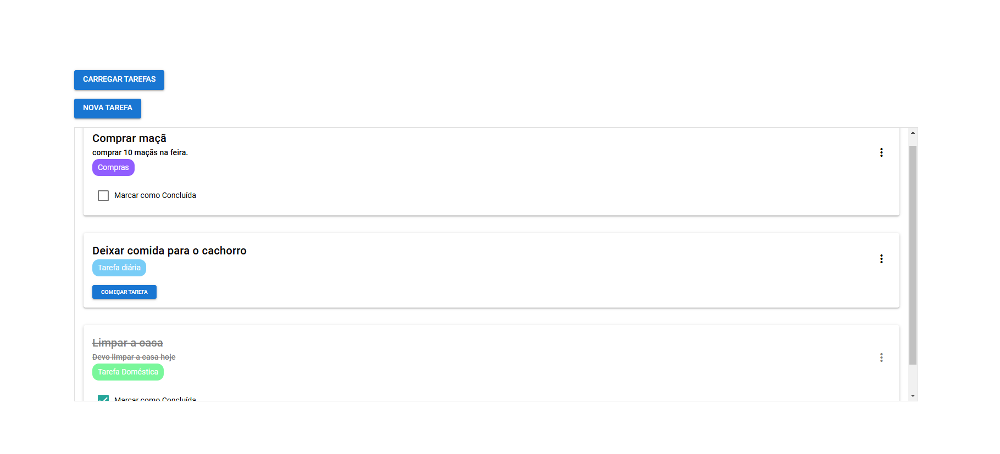

<h1 align="center">TodoList Frontend</h1>

---
<p align="center">
    <a href="#sobre">Sobre</a> •
    <a href="#tecnologias">Tecnologias</a> •
    <a href="#instalacao">Instalação</a> •
    <a href="#autor">Autor</a>
</p>

<h2 id="sobre">✨ Sobre</h2>

Este projeto é uma aplicação de Todo List feita em Quasar e Vue.

<p align="center">
  
</p>
<br><br>

<h2 id="tecnologias">🛠 Tecnologias</h2>

+ Quasar 2.16.0
+ Vue 3.4.18
+ Axios 1.7.9


<h2 id="instalacao">🚀 Como executar o projeto</h2>
Siga os passos abaixo para executar o projeto em seu ambiente local:


1. **Você deve estar executando o back-end e o banco de dados na sua máquina:**
   [Link do back-end](https://github.com/Victordplima/TodoList-Back)
   
2. **Clone o repositório**
   ```bash
   https://github.com/Victordplima/TodoList-Front.git
   ```
   
3. **Navegue até os arquivos**
   ```bash
   cd TodoList-Front
   ```

4. **Instalação de Dependências**
   ```bash
   npm install
   ```

5. **Configure o .env com a url do back-end**
   `
    VUE_APP_API_URL=http://127.0.0.1:8000/api
   `

5. **Inicialização da Aplicação**
   ```bash
   npm run dev
   ```

<h2 id="autor">👨‍💻 Autor</h2>

[Victor Dala Paula de Lima](https://github.com/Victordplima)
